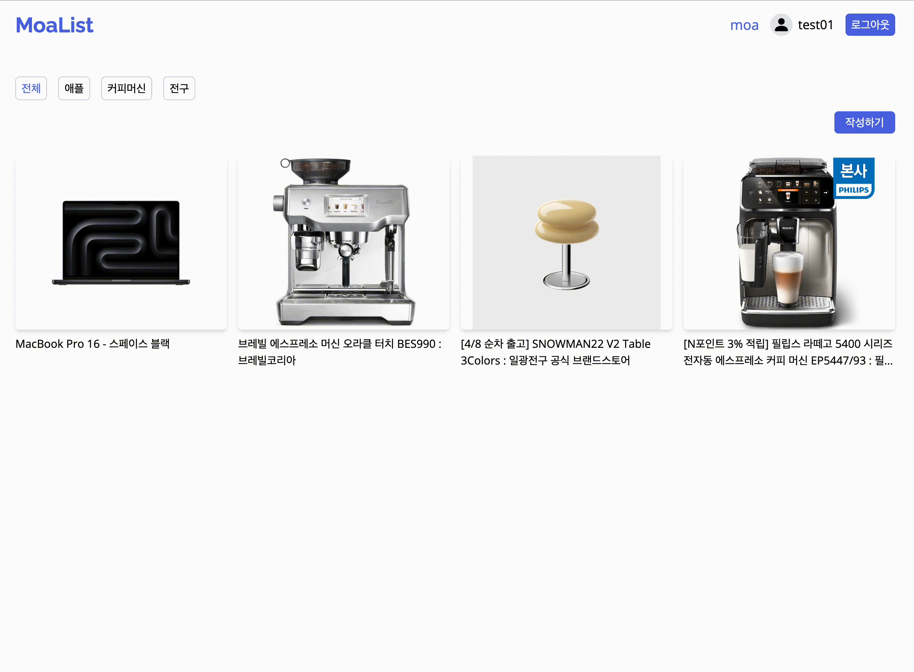

# MOA LIST

   
  
   

<ul>
  <li>배포 URL: <a href="https://moa-list.vercel.app" target="_blank
  ">https://moa-list.vercel.app</a></li>
  <li>Test ID: test01</li>
  <li>Test PW: 1234</li>
</ul>

목차

## 프로젝트 소개

<ul align="justify">
  <li>나만의 갈망템을 한 곳에서 관리할 수 있는 홈페이지 입니다.</li>
  <li>url, 카테고리 입력만으로 간단하게 저장할 수 있습니다.</li>
</ul>

 

## 기술 스택

|  NextJS   |  React   |  Node   |  MongoDB   |  Vercel   | Tailwindcss |  Github   |
| :-------: | :------: | :-----: | :--------: | :-------: | :---------: | :-------: |
| ![nextjs] | ![react] | ![node] | ![mongoDB] | ![vercel] | ![tailwind] | ![github] |

 

## 구현 기능

### NextJS 로그인, 로그아웃 기능

### URL, 카테고리 입력 만으로 간단하게 저장하기

### 카테고리 별로 모아보기

### 상세 보기 페이지 내 댓글 입력 및 리스트 구현

### 아이템 삭제 기능 구현

 

## 업데이트 예정

  Typescript 적용 예정

 

## 라이센스

MIT &copy; [wisdomshin.dev](mailto:wisdomshin.dev@gmail.com)

<!-- Stack Icon Refernces -->

[nextjs]: /public/readme/nextdotjs.svg
[react]: /public/readme/react.svg
[node]: /public/readme/nodedotjs.svg
[mongoDB]: /public/readme/mongodb.svg
[vercel]: /public/readme/vercel.svg
[tailwind]: /public/readme/tailwindcss.svg
[github]: /public/readme/github.svg
